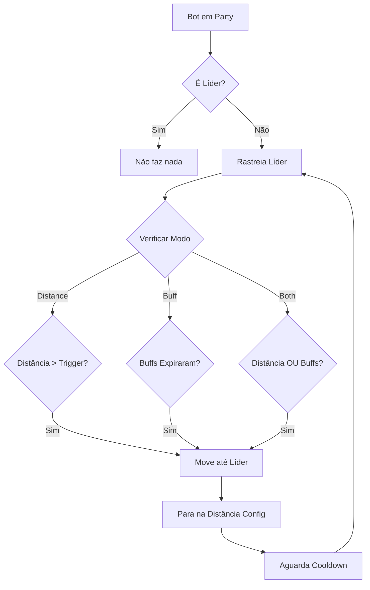

<div align="center">

# 🔮 Auto Renew Buffs

### Plugin Inteligente para OpenKore

*Rastreamento automático de líder e renovação de buffs para Ragnarok Online*

[](http://openkore.com/)
[](https://github.com/yourusername/opk-auto-renew-buffs)
[](LICENSE)

[✨ Features](#-features) • [🚀 Quick Start](#-quick-start) • [📖 Documentação](#-documentação) • [🎯 Casos de Uso](#-casos-de-uso)

</div>

---

## 🎯 O que é?

**Auto Renew Buffs** é um plugin avançado para OpenKore que automatiza o movimento e renovação de buffs em parties de Ragnarok Online. Perfeito para **buff bots**, **supports** e **personagens de suporte** que precisam manter buffs ativos no líder da party.

### Por que usar?

✅ **Inteligente** - Detecta automaticamente a composição da party (Priest, Bard, Dancer)
✅ **Flexível** - 3 modos de movimento: distância, buffs ou ambos
✅ **Seguro** - Sistema de cooldown e validações para evitar comportamento suspeito
✅ **Configurável** - Todas as configurações ajustáveis em tempo real
✅ **Debug Friendly** - Modo debug completo para troubleshooting

---

## ✨ Features

<table>
<tr>
<td width="50%">

### 🎯 Rastreamento Inteligente
- 📍 Rastreia posição do líder em tempo real
- 📏 Calcula distância automaticamente
- 🗺️ Detecta mudança de mapa
- 👁️ Funciona com líder visível ou invisível
- ⚡ Atualização contínua de coordenadas

</td>
<td width="50%">

### 🚶 Movimento Adaptativo
- 🎯 "Ir e ficar" (não é follow contínuo)
- ⏱️ Sistema de cooldown configurável
- 🛡️ Validações de segurança
- 🎮 Respeita ações em andamento
- 📐 Distâncias personalizáveis

</td>
</tr>
<tr>
<td width="50%">

### 💫 Sistema de Buffs
- 🔍 Monitora Blessing, Inc Agi, Richmankim, Assassin Cross
- 🤖 Detecta automaticamente Bard/Dancer na party
- 🧠 Lógica adaptativa por composição
- ⏰ Movimento quando buffs expiram
- 📊 Histórico de buffs

</td>
<td width="50%">

### ⚙️ Controle Total
- 💬 Comandos de console completos
- 🔧 Configurações em tempo real
- 🐛 Modo debug detalhado
- 📝 Status completo do sistema
- 🎛️ 3 modos de movimento

</td>
</tr>
</table>

---

## 🚀 Quick Start

### Instalação Rápida

1️⃣ **Clone o repositório**
```bash
git clone https://github.com/yourusername/opk-auto-renew-buffs.git
cd opk-auto-renew-buffs
```

2️⃣ **Copie o plugin para o OpenKore**
```bash
# Copie a pasta autoRenewBuffs para: openkore/plugins/
cp -r autoRenewBuffs /path/to/openkore/plugins/
```

3️⃣ **Configure no config.txt**
```txt
# Configuração básica
autoRenewBuffs_enabled 1
autoRenewBuffs_followEnabled 1
autoRenewBuffs_movementMode both
autoRenewBuffs_followDistance 3
autoRenewBuffs_followTriggerDistance 7
autoRenewBuffs_moveCooldown 30
```

4️⃣ **Inicie o OpenKore e entre em uma party!**

### Uso Básico

```bash
arb status              # Ver status atual do plugin
arb follow on           # Ativar movimento automático
arb mode buff           # Mudar para modo buff
arb buffstatus          # Ver status dos buffs ativos
arb debug               # Ativar modo debug
```

---

## 🎮 Modos de Operação

### 🎯 Modo Distance (Distância)
Move até o líder quando está muito longe
```txt
autoRenewBuffs_movementMode distance
autoRenewBuffs_followTriggerDistance 7
```

### 💫 Modo Buff (Renovação)
Move até o líder quando buffs expiram
```txt
autoRenewBuffs_movementMode buff
autoRenewBuffs_buffCheckInterval 1
```

### 🔄 Modo Both (Híbrido)
Combina distância + buffs (o que acontecer primeiro)
```txt
autoRenewBuffs_movementMode both
```

---

## 🎯 Casos de Uso

<details>
<summary><b>🔮 Buff Bot - Fica bem perto do líder</b></summary>

```txt
autoRenewBuffs_enabled 1
autoRenewBuffs_followEnabled 1
autoRenewBuffs_movementMode buff
autoRenewBuffs_followDistance 2
autoRenewBuffs_followTriggerDistance 5
autoRenewBuffs_moveCooldown 20
```
</details>

<details>
<summary><b>⚕️ Support Normal - Distância média</b></summary>

```txt
autoRenewBuffs_enabled 1
autoRenewBuffs_followEnabled 1
autoRenewBuffs_movementMode both
autoRenewBuffs_followDistance 3
autoRenewBuffs_followTriggerDistance 7
autoRenewBuffs_moveCooldown 30
```
</details>

<details>
<summary><b>🎵 Bard/Dancer - Apenas rastreamento</b></summary>

```txt
autoRenewBuffs_enabled 1
autoRenewBuffs_followEnabled 0
autoRenewBuffs_checkInterval 2
```
</details>

<details>
<summary><b>🔄 Híbrido - Máxima eficiência</b></summary>

```txt
autoRenewBuffs_enabled 1
autoRenewBuffs_followEnabled 1
autoRenewBuffs_movementMode both
autoRenewBuffs_followDistance 3
autoRenewBuffs_followTriggerDistance 10
autoRenewBuffs_moveCooldown 30
autoRenewBuffs_buffCheckInterval 1
```
</details>

---

## 📖 Documentação

### Comandos Disponíveis

| Comando | Descrição |
|---------|-----------|
| `arb status` | Exibe status completo do plugin |
| `arb on/off` | Ativa/desativa o plugin |
| `arb follow [on\|off]` | Controla movimento automático |
| `arb mode <type>` | Define modo (distance/buff/both) |
| `arb buffstatus` | Mostra status dos buffs |
| `arb resetbuffs` | Reseta histórico de buffs |
| `arb debug` | Liga/desliga modo debug |
| `arb setdist <stop> <trigger>` | Configura distâncias |
| `arb setcooldown <seg>` | Define cooldown entre movimentos |

### Configurações Principais

| Configuração | Padrão | Descrição |
|--------------|--------|-----------|
| `autoRenewBuffs_enabled` | 1 | Ativa/desativa plugin |
| `autoRenewBuffs_followEnabled` | 0 | Ativa movimento automático |
| `autoRenewBuffs_movementMode` | distance | Modo: distance/buff/both |
| `autoRenewBuffs_followDistance` | 3 | Distância de parada (células) |
| `autoRenewBuffs_followTriggerDistance` | 7 | Distância para disparar movimento |
| `autoRenewBuffs_moveCooldown` | 30 | Cooldown entre movimentos (seg) |
| `autoRenewBuffs_checkInterval` | 2 | Intervalo de verificação (seg) |

📚 **[Documentação Completa](autoRenewBuffs/README.md)** - Veja todas as configurações e funcionalidades

---

## 🧠 Como Funciona



### Lógica Adaptativa de Buffs

**Party SEM Bard/Dancer:**
- Move quando `Blessing` OU `Inc Agi` expira

**Party COM Bard/Dancer:**
- Move quando `Richmankim` OU `Assassin Cross` expira
- Ignora Blessing/Inc Agi (prioriza buffs de Bard/Dancer)

---

## 🛡️ Validações de Segurança

O plugin NÃO move se:

- ❌ Você é o líder da party
- ❌ Líder está em mapa diferente
- ❌ Líder está offline
- ❌ Coordenadas não disponíveis
- ❌ Há ações críticas em andamento (ataque, skill)
- ❌ Está em cooldown
- ❌ Outro movimento já está ativo

---

## 🔧 Troubleshooting

### Plugin não está movendo?

```bash
arb status              # Verifique se está ativado
arb follow on           # Ative o movimento
arb debug               # Veja logs detalhados
```

### Buffs não estão sendo detectados?

```bash
arb buffstatus          # Veja buffs monitorados
arb resetbuffs          # Resete o histórico
arb mode buff           # Mude para modo buff
```

### Movimento muito frequente?

```bash
arb setcooldown 60      # Aumente o cooldown
arb setdist 3 15        # Aumente distância trigger
```

---

## 📊 Roadmap

- [x] **Fase 1** - Rastreamento e Movimento
- [x] **Fase 2** - Sistema de Buffs
- [ ] **Fase 3** - Auto Cast de Buffs (em desenvolvimento)
- [ ] **Fase 4** - Sistema de Macros e Notificações

---

## 🤝 Contribuindo

Contribuições são bem-vindas! Sinta-se livre para:

1. 🍴 Fork o projeto
2. 🔨 Criar uma branch (`git checkout -b feature/MinhaFeature`)
3. 💾 Commit suas mudanças (`git commit -m 'Adiciona MinhaFeature'`)
4. 📤 Push para a branch (`git push origin feature/MinhaFeature`)
5. 🎉 Abrir um Pull Request

---

## 📝 License

Este projeto está sob a licença MIT. Veja o arquivo [LICENSE](LICENSE) para mais detalhes.

---

## 💖 Créditos

Desenvolvido com base nos plugins do OpenKore: `busFollow`, `busParty`, `wait4party`

**Documentação OpenKore**: http://openkore.com/wiki

---

<div align="center">

### ⭐ Se este projeto te ajudou, considere dar uma estrela!

**[⬆ Voltar ao topo](#-auto-renew-buffs)**

</div>
